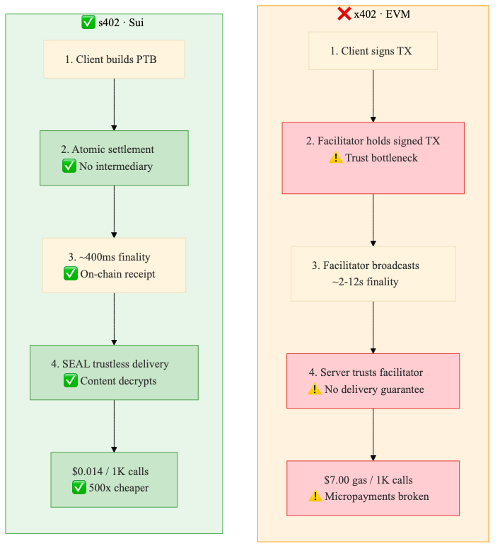
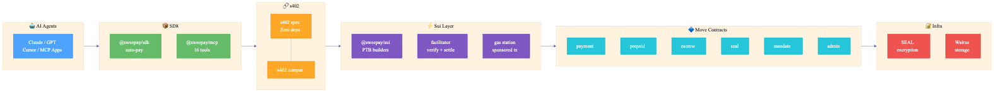

# SweePay

> **s402** — Sui-native HTTP 402 payments for the agentic economy.

**AI agents that can pay, stream, escrow, and prove — natively on-chain. No API keys. No subscriptions. Just HTTP 402 + crypto.**

```typescript
// 3 lines: AI agent auto-pays for premium data
import { createS402Client } from '@sweepay/sdk/client';

const client = createS402Client({ wallet: myKeypair, network: 'sui:testnet' });
const data = await client.fetch('https://api.example.com/premium-data');
// 402 → auto-signs SUI payment → retries → returns data
```

## What Is This?

SweePay is payment infrastructure purpose-built for the agentic economy. AI agents need to pay for APIs, computing resources, and digital goods — without human intervention, credit cards, or centralized custody.

SweePay is the payment layer of the **Swee ecosystem**: **SweePay** (payments) + **SweeAgent** (agent identity & reputation, `@sweeagent/*`) + **SweeWorld** (geo-location consumer app). This monorepo contains SweePay — the foundation everything else builds on.

**s402** is a Sui-native HTTP 402 protocol that is wire-compatible with [x402](https://x402.org) but architecturally superior:



| Feature | x402 (EVM) | s402 (Sui) |
|---------|-----------|-----------|
| Settlement | Verify first, settle later (temporal gap) | Atomic PTBs (no gap) |
| Payment modes | Exact only | Exact + Prepaid + Escrow (v0.1), + Seal + Stream (v0.2) |
| Micro-payments | $7.00 gas per 1K API calls (broken) | $0.014 gas per 1K calls via prepaid |
| Agent authorization | None | AP2 Mandates (spending limits) |
| Content gating | Server-trust (server controls access) | Trustless (SEAL threshold encryption) |
| Finality | ~12s (Ethereum L1), ~2s (Base L2) | ~400ms (Sui) |
| Facilitator | Required (trust bottleneck) | Optional (direct settlement) |
| Receipts | Off-chain | On-chain NFTs |
| Security model | Sign-first (facilitator holds signed txs) | Settle-first (atomic on-chain) |

## The s402 Protocol

```
Agent                    Server                  Sui Testnet
  |                        |                        |
  |-- GET /api/data ------>|                        |
  |                        |                        |
  |<-- 402 + requirements -|                        |
  |    {s402Version: "1",  |                        |
  |     amount: "1000",    |                        |
  |     accepts: ["exact"]}|                        |
  |                        |                        |
  | [auto-detect s402]     |                        |
  | [sign payment TX]      |                        |
  |                        |                        |
  |-- GET + X-PAYMENT ---->|                        |
  |                        |-- execute signed TX -->|
  |                        |                        |
  |                        |<-- TX digest ----------|
  |                        |                        |
  |<-- 200 + data ---------|                        |
  |    + payment-response  |                        |
```

**Key insight**: The agent never knows prices upfront. It discovers requirements via the 402 response and pays automatically. Works across any API, any price, any payment scheme.

## Payment Schemes

### v0.1 — The Core Three

| Scheme | Use Case | How It Works | Status |
|--------|----------|-------------|--------|
| **Exact** | One-shot API calls | Sign transfer, execute, done | **E2E demo'd** |
| **Prepaid** | AI agent API budgets, high-frequency access | Deposit funds → off-chain API calls → provider batch-claims | Move module in dev |
| **Escrow** | Digital goods, freelance work | Lock funds, release on delivery, refund on deadline | Contracts deployed, HTTP integration ready |

**Pay per call. Fund agent budgets. Trade trustlessly.** x402 gives you the first one. SweePay gives you all three.

### v0.2 — Split + Content + Streaming

| Scheme | Use Case | How It Works | Status |
|--------|----------|-------------|--------|
| **Split** | Multi-party settlement (royalties, affiliates) | One PTB splits payment to N recipients atomically | Planned |
| **Seal** | Pay-to-decrypt (trustless content gating) | Pay → receipt → SEAL key servers release decryption key | Token-gated deployed, receipt-gated in progress |
| **Stream** | Continuous access (AI inference, video) | Create stream on first 402, use stream-id for ongoing access | Contracts deployed, HTTP integration ready |

**Together these enable autonomous digital commerce without platforms.** An AI agent can deposit a budget (prepaid), call APIs (exact), buy goods trustlessly from a stranger (escrow) — all without a human, an API key, or a platform taking 30%. See [SPEC.md](SPEC.md) for the full vision.

## Architecture



```
AI Agent (Claude, GPT, Cursor, etc.)
    |
    +-- s402 fetch wrapper ------> @sweepay/sdk (auto-pay client)
    |                                   |
    +-- MCP tool discovery -------> @sweepay/mcp (16 tools)
    |                                   |
    +-- Direct PTB --------------> @sweepay/sui (PTB builders)
    |                                   |
    |                         s402 (protocol spec, zero deps)
    |                                   |
    |                         @sweepay/facilitator (verify + settle)
    |                                   |
    +-- Agent identity ----------> @sweeagent/identity   [FUTURE]
    +-- Agent reputation --------> @sweeagent/reputation [FUTURE]
    +-- Agent discovery ---------> @sweeagent/registry   [FUTURE]
                                        |
                              Sui blockchain (6 Move modules, 101 on-chain tests)
                                        |
                                 +------+------+
                                 |  payment    | Direct pay + receipts
                                 |  stream     | Micropayments + budget caps
                                 |  escrow     | Time-locked + arbiter disputes
                                 |  seal_policy| Pay-to-decrypt via SEAL
                                 |  mandate    | AP2 agent spending limits
                                 |  admin      | Protocol governance
                                 +-------------+
```

## Packages

| Package | Description | Tests |
|---------|-------------|-------|
| [`s402`](packages/s402-core) | Chain-agnostic HTTP 402 protocol spec (zero deps) | 207 |
| [`@sweepay/core`](packages/core) | Shared types, network configs, client factories | 54 |
| [`@sweepay/sui`](packages/sui) | 18 PTB builders for all contract operations | 114 |
| [`@sweepay/sdk`](packages/sdk) | Client + server SDK (3-line integration) | 6 |
| [`@sweepay/facilitator`](packages/facilitator) | Self-hostable payment verification service | 37 |
| [`@sweepay/mcp`](packages/mcp) | MCP server with 16 AI agent tools | 40 |
| [`@sweepay/cli`](packages/cli) | CLI tool — wallet, pay, prepaid, mandates | 42 |
| [`@sweepay/widget`](packages/widget) | Checkout UI — Vue + React adapters | 6 |
| [`sweepay-contracts`](contracts) | 8 Move modules on Sui testnet (v7) | 226 |

**Total: 732 tests (506 TypeScript + 226 Move)**

## Try It Now

### 1. See a 402 in action (no wallet needed)

```bash
# Hit the free endpoint — works normally
curl https://sweepay-demo.fly.dev/api/weather

# Hit the premium endpoint — get a 402 with payment requirements
curl -i https://sweepay-demo.fly.dev/api/forecast
# HTTP/1.1 402 Payment Required
# payment-required: eyJzNDAyVmVyc2lvbiI6IjEiLC...
# {"error":"Payment Required","price":"1000 MIST"}

# Check what the server accepts
curl https://sweepay-demo.fly.dev/.well-known/s402.json
# {"s402Version":"1","schemes":["exact"],"networks":["sui:testnet"],...}
```

### 2. Full agent demo (needs testnet wallet)

```bash
# Get testnet SUI: https://faucet.sui.io
cd demos/agent-pays-api
pnpm install
SUI_PRIVATE_KEY=<base64-key> pnpm demo
```

The demo starts a Hono server with free + premium endpoints, then runs an agent that:
1. Hits free endpoint (200, no payment)
2. Hits premium endpoint (402, auto-detects s402, signs payment, retries)
3. Gets premium data back with on-chain settlement proof

Cost: ~6,000 MIST (0.000006 SUI) + gas on testnet.

## Quick Start

### AI agent paying for APIs (client)

```typescript
import { createS402Client } from '@sweepay/sdk/client';
import { Ed25519Keypair } from '@mysten/sui/keypairs/ed25519';

const wallet = Ed25519Keypair.fromSecretKey(myKey);
const client = createS402Client({
  wallet,
  network: 'sui:testnet',
});

// Any fetch to a 402-gated endpoint auto-pays
const response = await client.fetch('https://api.example.com/premium');
```

### API provider gating endpoints (server)

```typescript
import { Hono } from 'hono';
import { s402Gate } from '@sweepay/sdk/server';

const app = new Hono();

app.use('/premium', s402Gate({
  price: '1000000',        // 0.001 SUI
  network: 'sui:testnet',
  payTo: '0xYOUR_ADDRESS',
  schemes: ['exact'],      // Also supports: stream, escrow, seal
}));

app.get('/premium', (c) => c.json({ data: 'premium content' }));
```

### Streaming payment with budget cap

```typescript
import { buildCreateStreamTx } from '@sweepay/sui/ptb';

const tx = buildCreateStreamTx(config, {
  coinType: '0x2::sui::SUI',
  sender: myAddress,
  recipient: agentAddress,
  depositAmount: 1_000_000_000n,  // 1 SUI
  ratePerSecond: 1_000_000n,      // 0.001 SUI/sec
  budgetCap: 5_000_000_000n,      // Max 5 SUI total
  feeBps: 0,
  feeRecipient: ZERO_ADDRESS,
});
```

### AP2 Mandate (agent spending authorization)

```typescript
import { buildCreateMandateTx, buildMandatedPayTx } from '@sweepay/sui/ptb';

// Human creates mandate for AI agent
const createTx = buildCreateMandateTx(config, {
  coinType: '0x2::sui::SUI',
  sender: humanAddress,
  delegate: agentAddress,
  maxPerTx: 1_000_000n,           // 0.001 SUI per transaction
  maxTotal: 100_000_000n,         // 0.1 SUI lifetime cap
  expiresAtMs: BigInt(Date.now() + 30 * 24 * 60 * 60 * 1000), // 30 days
});

// Agent pays with mandate validation (atomic)
const payTx = buildMandatedPayTx(config, {
  coinType: '0x2::sui::SUI',
  sender: agentAddress,
  recipient: merchantAddress,
  amount: 500_000n,
  mandateId: '0xMANDATE_OBJECT_ID',
  feeBps: 0,
  feeRecipient: ZERO_ADDRESS,
});
```

## MCP Tools (AI-Native)

Any MCP-compatible AI agent can discover and use these 16 tools:

| Tool | Description |
|------|-------------|
| `sweepay_pay` | Direct payment with optional fee + memo |
| `sweepay_pay_and_prove` | Atomic pay + receipt (SEAL flow) |
| `sweepay_create_invoice` | Create payment invoice NFT |
| `sweepay_pay_invoice` | Pay an existing invoice |
| `sweepay_start_stream` | Start streaming micropayment with budget cap |
| `sweepay_stop_stream` | Close stream, refund remaining deposit |
| `sweepay_create_escrow` | Create time-locked escrow with arbiter |
| `sweepay_release_escrow` | Release funds to seller |
| `sweepay_refund_escrow` | Refund to buyer (permissionless after deadline) |
| `sweepay_dispute_escrow` | Raise dispute, lock to arbiter resolution |
| `sweepay_check_balance` | Check SUI/USDC/USDT balance |
| `sweepay_check_payment` | Query payment history |
| `sweepay_get_receipt` | Fetch receipt details |
| `sweepay_supported_tokens` | List supported tokens |

### Claude Desktop Setup

```json
{
  "mcpServers": {
    "sweepay": {
      "command": "node",
      "args": ["packages/mcp/dist/index.mjs"],
      "env": {
        "SUI_NETWORK": "testnet",
        "SUI_PRIVATE_KEY": "<base64 Ed25519 key>"
      }
    }
  }
}
```

## Safety Design

Every payment primitive includes permissionless recovery so funds never get stuck:

- **Streams**: Budget cap is a hard kill switch. Recipient can force-close abandoned streams after timeout.
- **Escrow**: After the deadline, _anyone_ can trigger a refund. Arbiter resolves disputes before deadline.
- **Mandates**: Per-transaction limits + lifetime caps + expiry. Delegator can revoke via on-chain registry.
- **Receipts**: On-chain PaymentReceipt and EscrowReceipt serve as SEAL decryption credentials.

No admin keys control user funds.

## Smart Contracts

Deployed on Sui testnet v7. 8 modules, 226 Move test annotations (158 positive + 68 negative-path), AdminCap + ProtocolState for governance.

| Module | Purpose |
|--------|---------|
| `payment` | Direct payments, invoices, receipts |
| `stream` | Streaming micropayments with budget caps |
| `escrow` | Time-locked escrow with arbiter disputes |
| `seal_policy` | SEAL integration for pay-to-decrypt |
| `mandate` | Basic AP2 spending delegation + revocation |
| `agent_mandate` | L0-L3 progressive autonomy with lazy daily/weekly reset |
| `prepaid` | Deposit-based agent budgets with rate-capped batch claims |
| `admin` | AdminCap, ProtocolState, pause/unpause/burn |

Package ID (testnet v7): `0xc80485e9182c607c41e16c2606abefa7ce9b7f78d809054e99486a20d62167d5`

Token-gated SEAL (standalone): `0xbf9f9d63cbe53f21ac81af068e25e2c736fa2b0537c7e34d7d2862e330fe4fbc`

## x402 Compatibility

s402 is wire-compatible with x402. An s402 server always includes `"exact"` in its `accepts` array, so x402 clients can talk to s402 servers without modification. s402 clients auto-detect x402 servers via protocol detection (presence of `s402Version` field).

This means you can adopt s402 incrementally without breaking existing x402 integrations.

## Development

```bash
# Install
pnpm install

# Build all packages
pnpm -r build

# Run tests
pnpm -r test

# Typecheck
pnpm -r typecheck

# Move tests
cd contracts && sui move test

# Run agent demo
cd demos/agent-pays-api && SUI_PRIVATE_KEY=<key> pnpm demo
```

## Built On

- [Sui](https://sui.io) — High-performance L1 with PTBs and ~400ms finality
- [SEAL](https://docs.sui.io/concepts/cryptography/seal) — Sui's threshold encryption for programmable access control
- [x402](https://x402.org) — Coinbase's HTTP 402 payment protocol (wire-compatible)
- [MCP](https://modelcontextprotocol.io) — Anthropic's Model Context Protocol
- [Hono](https://hono.dev) — Lightweight web framework
- [@mysten/sui](https://github.com/MystenLabs/ts-sdks) — Official Sui TypeScript SDK

## The Swee Ecosystem

SweePay is the payment layer. The broader ecosystem includes:

| Brand | Role | Status |
|-------|------|--------|
| **SweePay** | Payment protocol + SDK (`s402`, `@sweepay/*`) | Shipping |
| **SweeAgent** | Agent identity, reputation, commerce network (`@sweeagent/*`) | Vision — seams architected |
| **SweeWorld** | Geo-location mobile app (Tauri) — pins, tipping, SEAL content | Brainstorm |

See [SPEC.md](SPEC.md) for the full vision and roadmap.

## License

MIT — see [LICENSE](LICENSE)
