# SweeFi

> **s402** — Sui-native HTTP 402 payments for the agentic economy.

**AI agents that can pay, stream, escrow, and prove — natively on-chain. No API keys. No subscriptions. Just HTTP 402 + crypto.**

```typescript
// 3 lines: AI agent auto-pays for premium data
import { createS402Client } from '@sweefi/sui';

const client = createS402Client({ wallet: myKeypair, network: 'sui:testnet' });
const data = await client.fetch('https://api.example.com/premium-data');
// 402 → auto-signs SUI payment → retries → returns data
```

## What Is This?

SweeFi is payment infrastructure purpose-built for the agentic economy. AI agents need to pay for APIs, computing resources, and digital goods — without human intervention, credit cards, or centralized custody.

SweeFi is the payment layer of the **Swee ecosystem**: **SweeFi** (payments) + **SweeAgent** (agent identity & reputation, `@sweeagent/*`) + **SweeWorld** (geo-location consumer app). This monorepo contains SweeFi — the foundation everything else builds on.

**s402** is a Sui-native HTTP 402 protocol that is wire-compatible with [x402](https://x402.org) but architecturally superior:



| Feature | x402 (EVM) | s402 (Sui) |
|---------|-----------|-----------|
| Settlement | Verify first, settle later (temporal gap) | Atomic PTBs (no gap) |
| Payment modes | Exact only | Exact, Prepaid, Escrow, Stream, Seal |
| Micro-payments | ~$1 gas per 1K calls (Base L2, per-call settlement) | $0.014 gas per 1K calls via prepaid batching |
| Agent authorization | None | AP2 Mandates (spending limits) |
| Content gating | Server-trust (server controls access) | Trustless (SEAL threshold encryption) |
| Finality | ~12s (Ethereum L1), ~2s (Base L2) | ~400ms (Sui) |
| Facilitator | Required (trust bottleneck) | Optional (direct settlement) |
| Receipts | Off-chain | On-chain NFTs |
| Security model | Sign-first (facilitator holds signed txs) | Settle-first (atomic on-chain) |

## The s402 Protocol

```
Agent                    Server                  Sui Testnet
  |                        |                        |
  |-- GET /api/data ------>|                        |
  |                        |                        |
  |<-- 402 + requirements -|                        |
  |    {s402Version: "1",  |                        |
  |     amount: "1000",    |                        |
  |     accepts: ["exact"]}|                        |
  |                        |                        |
  | [auto-detect s402]     |                        |
  | [sign payment TX]      |                        |
  |                        |                        |
  |-- GET + x-payment ---->|                        |
  |                        |-- execute signed TX -->|
  |                        |                        |
  |                        |<-- TX digest ----------|
  |                        |                        |
  |<-- 200 + data ---------|                        |
  |    + payment-response  |                        |
```

**Key insight**: The agent never knows prices upfront. It discovers requirements via the 402 response and pays automatically. Works across any API, any price, any payment scheme.

## Payment Schemes

### Deployed Schemes (Sui Testnet)

| Scheme | Use Case | How It Works | Status |
|--------|----------|-------------|--------|
| **Exact** | One-shot API calls | Sign transfer, execute, done | **Deployed, facilitator complete** |
| **Prepaid** | AI agent API budgets, high-frequency access | Deposit funds → off-chain API calls → provider batch-claims | **Deployed, facilitator complete** |
| **Escrow** | Digital goods, freelance work | Lock funds, release on delivery, refund on deadline | **Deployed, 5 PTB builders** |
| **Stream** | Continuous access (AI inference, video) | Create stream on first 402, use stream-id for ongoing access | **Deployed, 9 PTB builders** |
| **Seal** | Pay-to-decrypt (trustless content gating) | Pay → receipt → SEAL key servers release decryption key | **Token-gated deployed** |

**Pay per call. Fund agent budgets. Trade trustlessly. Stream micropayments. Gate content.** x402 gives you the first one. SweeFi gives you all five.

### Future Schemes

| Scheme | Use Case | Status |
|--------|----------|--------|
| **Unlock** | Receipt-gated SEAL decryption | Client scheme exists, facilitator handler planned |
| **Split** | Multi-party settlement (royalties, affiliates) | Planned |

**Together these enable autonomous digital commerce without platforms.** An AI agent can deposit a budget (prepaid), call APIs (exact), buy goods trustlessly from a stranger (escrow), stream micropayments for inference (stream), and access encrypted content (seal) — all without a human, an API key, or a platform taking 30%. See [SPEC.md](https://github.com/sweeinc/sweefi/blob/main/SPEC.md) for the full vision.

## Architecture


```
AI Agent (Claude, GPT, Cursor, etc.)
    |
    +-- s402 fetch wrapper ------> @sweefi/sui (auto-pay client + SuiPaymentAdapter)
    |                                   |
    +-- MCP tool discovery -------> @sweefi/mcp (30+5 opt-in tools)
    |                                   |
    +-- Direct PTB --------------> @sweefi/sui (42 PTB builders)
    |                                   |
    +-- CLI ----------------------> @sweefi/cli
    |                                   |
    |    @sweefi/server (chain-agnostic HTTP: s402Gate, wrapFetchWithS402)
    |    @sweefi/ui-core (state machine + PaymentAdapter interface)
    |    @sweefi/vue   (Vue 3 plugin + useSweefiPayment composable)
    |    @sweefi/react (React context + useSweefiPayment hook)
    |                                   |
    |                         s402 (protocol spec, npm package)
    |                                   |
    |                         @sweefi/facilitator (verify + settle, Docker/Fly.io)
    |                                   |
    +-- Agent identity ----------> @sweeagent/identity   [FUTURE]
    +-- Agent reputation --------> @sweeagent/reputation [FUTURE]
    +-- Agent discovery ---------> @sweeagent/registry   [FUTURE]
                                        |
                              Sui blockchain (10 Move modules, testnet)
                                        |
                                 +------+------+
                                 |  payment    | Direct pay + receipts
                                 |  stream     | Micropayments + budget caps
                                 |  escrow     | Time-locked + arbiter disputes
                                 |  seal_policy| Pay-to-decrypt via SEAL
                                 |  prepaid    | Deposit-based agent budgets
                                 |  mandate    | AP2 agent spending limits
                                 |  agent_mndt | L0-L3 progressive autonomy
                                 |  identity   | Agent identity (did:sui)
                                 |  math       | Shared arithmetic utils
                                 |  admin      | Protocol governance
                                 +-------------+
```

## Packages

| Package | Description | Tests |
|---------|-------------|-------|
| [`@sweefi/ui-core`](/guide/ui-core) | Framework-agnostic state machine + PaymentAdapter interface | 13 |
| [`@sweefi/server`](/guide/server) | Chain-agnostic HTTP: s402Gate, wrapFetchWithS402 | 11 |
| [`@sweefi/sui`](/guide/sui) | 42 PTB builders + SuiPaymentAdapter + s402 schemes | 202 |
| [`@sweefi/vue`](/guide/vue) | Vue 3 plugin + useSweefiPayment() composable | 10 |
| [`@sweefi/react`](/guide/react) | React context + useSweefiPayment() hook | 12 |
| [`@sweefi/facilitator`](/guide/facilitator) | Self-hostable payment verification — Docker/Fly.io (not on npm) | 55 |
| [`@sweefi/mcp`](/guide/mcp) | MCP server — 30 default + 5 opt-in AI agent tools | 123 |
| [`@sweefi/cli`](/guide/cli) | CLI tool — wallet, pay, prepaid, mandates | 42 |
| [`@sweefi/solana`](/guide/solana) | Solana s402 adapter (exact scheme, SPL tokens) | 40 |
| [`@sweefi/ap2-adapter`](/guide/ap2-adapter) | AP2 mandate mapper + bridge | 52 |
| [`sweefi-contracts`](/guide/contracts) | 10 Move modules on Sui testnet | 264 |

**Total: 1,654 tests (1,228 TypeScript + 426 Move)**

**External**: [`s402`](https://www.npmjs.com/package/s402) (HTTP 402 protocol, v0.2.2), `@mysten/sui@2.6.0`, `@mysten/seal@1.0.1`

## Try It Now

### 1. Run the demo locally (needs testnet wallet)

```bash
# Get testnet SUI: https://faucet.sui.io
cd demos/agent-pays-api
pnpm install
SUI_PRIVATE_KEY=<base64-key> pnpm demo
```

The demo starts a Hono server with free + premium endpoints, then runs an agent that:
1. Hits free endpoint (200, no payment)
2. Hits premium endpoint (402, auto-detects s402, signs payment, retries)
3. Gets premium data back with on-chain settlement proof

Cost: ~6,000 MIST (0.000006 SUI) + gas on testnet.

## Quick Start

### AI agent paying for APIs (client)

```typescript
import { createS402Client } from '@sweefi/sui';
import { Ed25519Keypair } from '@mysten/sui/keypairs/ed25519';

const wallet = Ed25519Keypair.fromSecretKey(myKey);
const client = createS402Client({
  wallet,
  network: 'sui:testnet',
});

// Any fetch to a 402-gated endpoint auto-pays
const response = await client.fetch('https://api.example.com/premium');
```

### API provider gating endpoints (server)

```typescript
import { Hono } from 'hono';
import { s402Gate } from '@sweefi/server';

const app = new Hono();

app.use('/premium', s402Gate({
  price: '1000000',        // 0.001 SUI
  network: 'sui:testnet',
  payTo: '0xYOUR_ADDRESS',
  schemes: ['exact'],      // Also supports: stream, escrow, seal
}));

app.get('/premium', (c) => c.json({ data: 'premium content' }));
```

### Streaming payment with budget cap

```typescript
import { buildCreateStreamTx } from '@sweefi/sui/ptb';
import { ZERO_ADDRESS } from '@sweefi/sui';

const tx = buildCreateStreamTx(config, {
  coinType: '0x2::sui::SUI',
  sender: myAddress,
  recipient: agentAddress,
  depositAmount: 1_000_000_000n,  // 1 SUI
  ratePerSecond: 1_000_000n,      // 0.001 SUI/sec
  budgetCap: 5_000_000_000n,      // Max 5 SUI total
  feeMicroPercent: 0,
  feeRecipient: ZERO_ADDRESS,
});
```

### AP2 Mandate (agent spending authorization)

```typescript
import { buildCreateMandateTx, buildMandatedPayTx } from '@sweefi/sui/ptb';
import { ZERO_ADDRESS } from '@sweefi/sui';

// Human creates mandate for AI agent
const createTx = buildCreateMandateTx(config, {
  coinType: '0x2::sui::SUI',
  sender: humanAddress,
  delegate: agentAddress,
  maxPerTx: 1_000_000n,           // 0.001 SUI per transaction
  maxTotal: 100_000_000n,         // 0.1 SUI lifetime cap
  expiresAtMs: BigInt(Date.now() + 30 * 24 * 60 * 60 * 1000), // 30 days
});

// Agent pays with mandate validation (atomic)
const payTx = buildMandatedPayTx(config, {
  coinType: '0x2::sui::SUI',
  sender: agentAddress,
  recipient: merchantAddress,
  amount: 500_000n,
  mandateId: '0xMANDATE_OBJECT_ID',
  registryId: '0xREGISTRY_OBJECT_ID',
  feeMicroPercent: 0,
  feeRecipient: ZERO_ADDRESS,
});
```

## MCP Tools (AI-Native)

Any MCP-compatible AI agent can discover and use 30 tools by default + 5 opt-in:

**Payments** (4): `pay`, `pay_and_prove`, `create_invoice`, `pay_invoice`
**Streaming** (4): `start_stream`, `start_stream_with_timeout`, `stop_stream`, `recipient_close_stream`
**Escrow** (4): `create_escrow`, `release_escrow`, `refund_escrow`, `dispute_escrow`
**Prepaid** (7): `prepaid_deposit`, `prepaid_top_up`, `prepaid_request_withdrawal`, `prepaid_finalize_withdrawal`, `prepaid_cancel_withdrawal`, `prepaid_agent_close`, `prepaid_status`
**Mandates** (7): `create_mandate`, `create_agent_mandate`, `basic_mandated_pay`, `agent_mandated_pay`, `revoke_mandate`, `create_registry`, `inspect_mandate`
**Read-Only** (4): `check_balance`, `check_payment`, `get_receipt`, `supported_tokens`
**Opt-In Provider** (1): `prepaid_claim`
**Opt-In Admin** (4): `protocol_status`, `pause_protocol`, `unpause_protocol`, `burn_admin_cap`

All tool names prefixed with `sweefi_`. Transaction tools require `SUI_PRIVATE_KEY` env var.

### Claude Desktop Setup

```json
{
  "mcpServers": {
    "sweefi": {
      "command": "node",
      "args": ["packages/mcp/dist/cli.mjs"],
      "env": {
        "SUI_NETWORK": "testnet",
        "SUI_PRIVATE_KEY": "<base64 Ed25519 key>"
      }
    }
  }
}
```

## Safety Design

Every payment primitive includes permissionless recovery so funds never get stuck:

- **Streams**: Budget cap is a hard kill switch. Recipient can force-close abandoned streams after timeout.
- **Escrow**: After the deadline, _anyone_ can trigger a refund. Arbiter resolves disputes before deadline.
- **Mandates**: Per-transaction limits + lifetime caps + expiry. Delegator can revoke via on-chain registry.
- **Receipts**: On-chain PaymentReceipt and EscrowReceipt serve as SEAL decryption credentials.

No admin keys control user funds.

## Smart Contracts

Deployed on Sui testnet. 10 modules, 426 Move tests, AdminCap + ProtocolState for governance.

| Module | Purpose |
|--------|---------|
| `payment` | Direct payments, invoices, receipts |
| `stream` | Streaming micropayments with budget caps |
| `escrow` | Time-locked escrow with arbiter disputes |
| `seal_policy` | SEAL integration for pay-to-decrypt |
| `prepaid` | Deposit-based agent budgets with rate-capped batch claims |
| `mandate` | Basic AP2 spending delegation + revocation |
| `agent_mandate` | L0-L3 progressive autonomy with lazy daily/weekly reset |
| `identity` | Agent identity profiles (did:sui) |
| `math` | Shared arithmetic utilities (safe division, micro-percent fees) |
| `admin` | AdminCap, ProtocolState, pause/unpause/burn |

Package ID (testnet): `0xb83e50365ba460aaa02e240902a40890bec88cd35bd2fc09afb6c79ec8ea9ac5`

Token-gated SEAL (standalone): `0xbf9f9d63cbe53f21ac81af068e25e2c736fa2b0537c7e34d7d2862e330fe4fbc`

## x402 Compatibility

s402 is wire-compatible with x402. An s402 server always includes `"exact"` in its `accepts` array, so x402 clients can talk to s402 servers without modification. s402 clients auto-detect x402 servers via protocol detection (presence of `s402Version` field).

This means you can adopt s402 incrementally without breaking existing x402 integrations.

## Development

```bash
# Install
pnpm install

# Build all packages
pnpm -r build

# Run tests
pnpm -r test

# Typecheck
pnpm -r typecheck

# Move tests
cd contracts && sui move test

# Run agent demo
cd demos/agent-pays-api && SUI_PRIVATE_KEY=<key> pnpm demo
```

## Built On

- [Sui](https://sui.io) — High-performance L1 with PTBs and ~400ms finality
- [SEAL](https://docs.sui.io/concepts/cryptography/seal) — Sui's threshold encryption for programmable access control
- [x402](https://x402.org) — Coinbase's HTTP 402 payment protocol (wire-compatible)
- [MCP](https://modelcontextprotocol.io) — Anthropic's Model Context Protocol
- [Hono](https://hono.dev) — Lightweight web framework
- [@mysten/sui](https://github.com/MystenLabs/ts-sdks) — Official Sui TypeScript SDK

## The Swee Ecosystem

SweeFi is the payment layer. The broader ecosystem includes:

| Brand | Role | Status |
|-------|------|--------|
| **s402** | Open protocol standard (`s402` npm package) | Shipped, Apache 2.0 |
| **SweeFi** | Open source payment SDK (`@sweefi/*`) | Shipping, Apache 2.0 |
| **SweeWorld** | Agent marketplace — for-profit product built on SweeFi | Vision |
| **SweeCard** | TradFi/crypto bridge card | Phase 3+, backburner |

See [SPEC.md](https://github.com/sweeinc/sweefi/blob/main/SPEC.md) for the full vision and roadmap.

## Open Source

SweeFi is fully open source. Every developer-facing package is published under **Apache 2.0** — which includes an explicit patent grant, making it safe for commercial use in financial software.

| Package | License | Published |
|---------|---------|-----------|
| `s402` | Apache 2.0 | npm (public) |
| `@sweefi/ui-core` | Apache 2.0 | npm (public) |
| `@sweefi/server` | Apache 2.0 | npm (public) |
| `@sweefi/sui` | Apache 2.0 | npm (public) |
| `@sweefi/vue` | Apache 2.0 | npm (public) |
| `@sweefi/react` | Apache 2.0 | npm (public) |
| `@sweefi/mcp` | Apache 2.0 | npm (public) |
| `@sweefi/cli` | Apache 2.0 | npm (public) |
| `@sweefi/facilitator` | Apache 2.0 | Self-hostable (not on npm) |
| `sweefi-contracts` | Apache 2.0 | Deployed on Sui |

The facilitator source is open — you can read it, audit it, and self-host it. SweeFi also runs a **managed facilitator** as a hosted service. Self-hosting is always an option. See [`packages/facilitator`](/guide/facilitator) for Docker and Fly.io deployment instructions.

## License

Apache 2.0 — see [LICENSE](https://github.com/sweeinc/sweefi/blob/main/LICENSE)
